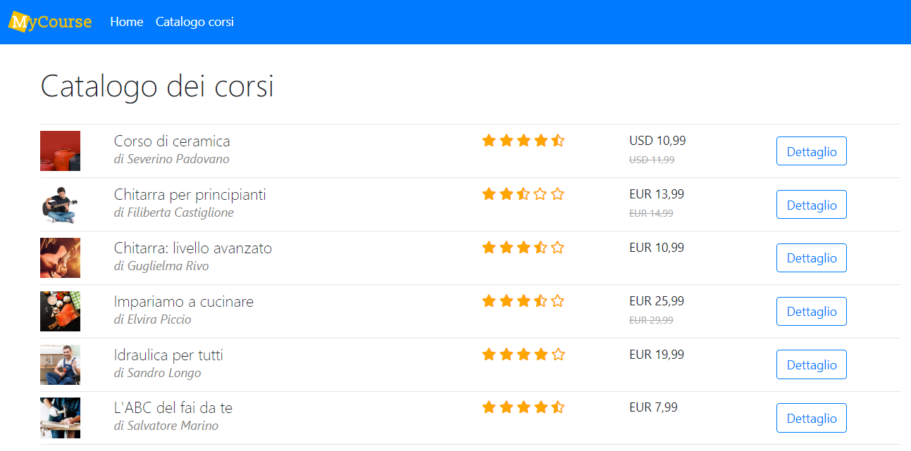

# MyCourse
In questo repository si trova il codice del progetto `MyCourse`, che viene presentato nel corso `ASP.NET Core per tutti` su Udemy.

[https://www.udemy.com/aspnetcore-per-tutti/](https://www.udemy.com/aspnetcore-per-tutti/)

## Panoramica
Il progetto è un'applicazione ASP.NET Core 2 dimostrativa per la pubblicazione e fruizione di corsi on-line. L'applicazione è pubblicata all'indirizzo:
[https://my-course.azurewebsites.net](https://my-course.azurewebsites.net)




## Ottenere il codice del progetto
Per chi non è abituato a usare GitHub, ecco spiegate le due opzioni per ottenere il codice di questo progetto:

 1. Per prima cosa [installare GIT](https://git-scm.com/book/it/v1/Per-Iniziare-Installare-Git#Installare-su-Linux) sul proprio PC o Mac. Poi creare una nuova cartella vuota, aprire il prompt dei comandi (anche chiamato _Terminale_) e posizionarsi nella directory appena creata digitando:
    ```
    cd percorsoDirectoryCreata
    ```
    a questo punto clonare il repository GIT digitando il comando:
    ```
    git clone https://github.com/ItalyDotNet/MyCourse.git .
    ```
 2. La seconda alternativa consiste semplicemente nello scaricare un file ZIP del progetto cliccando il bottone verde "Clone or download" che si trova in questa pagina e poi "Download ZIP".
    
    Prima di scaricare lo ZIP, selezionare il ramo che si intende ottenere cliccando il bottone grigio "Branch: master" che si trova in questa pagina.