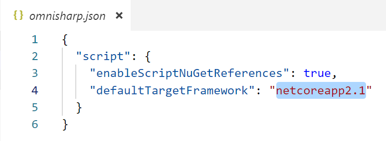

# Eseguire gli script C#
Le sottodirectory che trovi qui (es. lambda), contengono degli script C#. Non si tratta di veri progetti, ma di semplici file .csx che possono comunque essere eseguiti e debuggati da Visual Studio Code installando il tool `dotnet-script` con questo comando.

```
dotnet tool install -g dotnet-script
```

Questo comando va eseguito solo la prima volta, perché verrà installato a livello globale nel tuo sistema e perciò sarà disponibile ovunque da riga di comando.
Per iniziare a lavorare con gli script, portati in una directory vuota e digita:

```
dotnet script init
```

E poi apri questa directory in Visual Studio Code digitando:

```
code .
```

Oppure apri la directory al solito modo, dall'interfaccia grafica di Visual Studio Code.
Ora sei pronto per sperimentare con C#! Avrai il supporto del debugger e dell'IntelliSense!

## Risoluzione dei problemi

Se non riesci a fare il debug degli script o a vedere l'IntelliSense mentre digiti, verifica che OmniSharp si sia attivato. La sua icona, riportata nella status bar di Visual Studio Code, deve essere verde. Potrebbe volerci qualche secondo. Al limite aspetta un paio di minuti e poi chiudi e riapri Visual Studio Code.


Inoltre, puoi controllare quale versione di .NET Core usare dal file `omnisharp.json`. In questo caso sto usando la 2.1.

